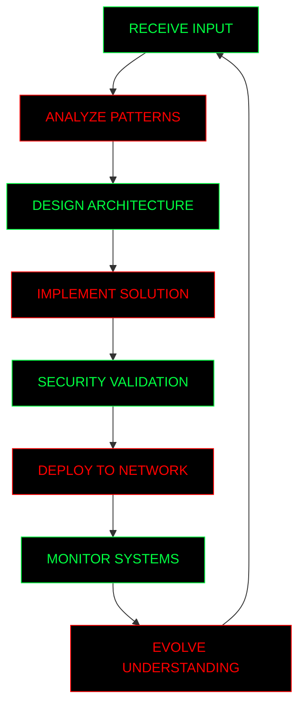

# ░░░░░░░░░░░░░░░░░░░░░░░░░░░░░░░░░░░░░░░░░░░░░░░░░░░░░░░░░░░░░░░░░░░░░░░░░░░░░░░░░░░░░░░░░░░░░░░░░░░░░░░░░░░░
# ░                                                                                                            ░
# ░    ██╗░░██╗███╗░░░███╗░█████╗░██╗░░░██╗░█████╗░███╗░░██╗██╗░░██╗██╗███████╗                               ░
# ░    ██║░██╔╝████╗░████║██╔══██╗██║░░░██║██╔══██╗████╗░██║██║░██╔╝██║██╔════╝                               ░
# ░    █████═╝░██╔████╔██║██║░░██║██║░░░██║███████║██╔██╗██║█████═╝░██║█████╗░░                               ░
# ░    ██╔═██╗░██║╚██╔╝██║██║░░██║██║░░░██║██╔══██║██║╚████║██╔═██╗░██║██╔══╝░░                               ░
# ░    ██║░╚██╗██║░╚═╝░██║╚█████╔╝╚██████╔╝██║░░██║██║░╚███║██║░╚██╗██║███████╗                               ░
# ░    ╚═╝░░╚═╝╚═╝░░░░░╚═╝░╚════╝░░╚═════╝░╚═╝░░╚═╝╚═╝░░╚══╝╚═╝░░╚═╝╚═╝╚══════╝                               ░
# ░                                                                                                            ░
# ░░░░░░░░░░░░░░░░░░░░░░░░░░░░░░░░░░░░░░░░░░░░░░░░░░░░░░░░░░░░░░░░░░░░░░░░░░░░░░░░░░░░░░░░░░░░░░░░░░░░░░░░░░░░

<div align="center">

```
░████████╗██╗░░██╗███████╗  ░██╗░░░░░░░██╗██╗██████╗░███████╗██████╗░
░╚══██╔══╝██║░░██║██╔════╝  ░██║░░██╗░░██║██║██╔══██╗██╔════╝██╔══██╗
░░░░██║░░░███████║█████╗░░  ░╚██╗████╗██╔╝██║██████╔╝█████╗░░██║░░██║
░░░░██║░░░██╔══██║██╔══╝░░  ░░████╔═████║░██║██╔══██╗██╔══╝░░██║░░██║
░░░░██║░░░██║░░██║███████╗  ░░╚██╔╝░╚██╔╝░██║██║░░██║███████╗██████╔╝
░░░░╚═╝░░░╚═╝░░╚═╝╚══════╝  ░░░╚═╝░░░╚═╝░░╚═╝╚═╝░░╚═╝╚══════╝╚═════╝░

░░░░░░░░░░░░░░░░░░░░░░░░░░░░░░░░░░░░░░░░░░░░░░░░░░░░░░░░░░░░░░░░░░░░░░░░░░░░░░░░░
 ▓▓▓▓▓▓▓▓▓▓▓▓▓▓▓▓▓▓▓▓▓▓▓▓▓▓▓▓▓▓▓▓▓▓▓▓▓▓▓▓▓▒░░░░░░░░░░░░░░░░░░░░░░░░░░░░░░░░░░░░░
```


</div>

## ▓▓▓▓▓▓▓▓▓▓▓▓▓▓▓▓▓▓▓▓▓▓▓▓▓▓▓▓▓▓▓▓▓▓▓▓▓▓▓▓▓▓▓▓▓▓▓▓▓▓▓▓▓▓▓▓▓▓▓▓▓▓▓▓▓▓▓▓▓▓▓▓▓▓▓▓▓▓▓▓▓▓▓▓▓▓▓▓▓▓▓▓▓▓▓▓▓▓▓▓▓▓▓▓▓▓▓▓

<div align="center">

```ascii
                    ░░░░░░░░░░░░░░░░░░░░░░░░░░░░░░░░░░░░░░░░░░░░░░░░░░░░░
                   ░                                                ░
                  ░   DEVELOPER | DIGITAL ARCHITECT | CODE SHAMAN    ░
                 ░        BRIDGING REALITIES THROUGH CODE            ░
                ░░░░░░░░░░░░░░░░░░░░░░░░░░░░░░░░░░░░░░░░░░░░░░░░░░░░░░
```

</div>

### ░░░░░░░░░░░░░░░░░░░░░░░░ SYSTEM.PROFILE.INIT() ░░░░░░░░░░░░░░░░░░░░░░░░

```python
class DigitalEntity:
    def __init__(self):
        self.name = "Kmouankie"
        self.identity = "Full Stack Developer | Security Researcher"
        self.reality_layer = "Physical World"
        self.wired_presence = True
        self.consciousness = {
            "languages": ["Python", "PHP", "JavaScript", "Vue.js"],
            "frameworks": {
                "reality": ["Django", "Laravel"],
                "wired": ["FastAPI", "Vue.js", "Node.js"],
                "protocol": ["REST", "GraphQL", "API Integration"]
            },
            "specializations": ["OSINT", "Security Tools", "Space Data"],
            "tools": ["Docker", "Linux", "Git", "Database Systems"],
            "purpose": "Transcend limitations through elegant code"
        }
    
    def connect_to_wired(self):
        return "Connection established... Reality boundaries dissolved."
    
    def manifest_projects(self):
        return "Creating tools that exist beyond conventional limits"
```

## ▓▓▓▓▓▓▓▓▓▓▓▓▓▓▓▓▓▓▓▓▓▓▓▓▓▓▓▓▓▓▓▓▓▓▓▓▓▓▓▓▓▓▓▓▓▓▓▓▓▓▓▓▓▓▓▓▓▓▓▓▓▓▓▓▓▓▓▓▓▓▓▓▓▓▓▓▓▓▓▓▓▓▓▓▓▓▓▓▓▓▓▓▓▓▓▓▓▓▓▓▓▓▓▓▓▓▓▓

### ░▒▓ PROTOCOL LAYER SEVEN ▓▒░

<table>
<tr>
<td width="50%" valign="top">

#### PYTHON.SECURITY.EXE
```terminal
> Loading OSINT protocols...
> Honeypot detection systems active...
> Network analysis tools initialized...
> API integration frameworks ready...
> DoS testing modules loaded...
> Status: WIRED CONNECTION STABLE
```

</td>
<td width="50%" valign="top">

#### WEB.DEVELOPMENT.EXE  
```terminal
> Vue.js frontend systems online...
> PHP/Laravel backend services ready...
> Django framework protocols active...
> Database connections established...
> API endpoints synchronized...
> Status: REALITY BRIDGE OPERATIONAL
```

</td>
</tr>
</table>

## ▓▓▓▓▓▓▓▓▓▓▓▓▓▓▓▓▓▓▓▓▓▓▓▓▓▓▓▓▓▓▓▓▓▓▓▓▓▓▓▓▓▓▓▓▓▓▓▓▓▓▓▓▓▓▓▓▓▓▓▓▓▓▓▓▓▓▓▓▓▓▓▓▓▓▓▓▓▓▓▓▓▓▓▓▓▓▓▓▓▓▓▓▓▓▓▓▓▓▓▓▓▓▓▓▓▓▓▓

### ░▒▓ MEMORY.STATS.DISPLAY() ▓▒░

<div align="center">


</div>

## ▓▓▓▓▓▓▓▓▓▓▓▓▓▓▓▓▓▓▓▓▓▓▓▓▓▓▓▓▓▓▓▓▓▓▓▓▓▓▓▓▓▓▓▓▓▓▓▓▓▓▓▓▓▓▓▓▓▓▓▓▓▓▓▓▓▓▓▓▓▓▓▓▓▓▓▓▓▓▓▓▓▓▓▓▓▓▓▓▓▓▓▓▓▓▓▓▓▓▓▓▓▓▓▓▓▓▓▓

### ░▒▓ TECHNOLOGY.STACK.JSON ▓▒░

<div align="center">


</div>

## ▓▓▓▓▓▓▓▓▓▓▓▓▓▓▓▓▓▓▓▓▓▓▓▓▓▓▓▓▓▓▓▓▓▓▓▓▓▓▓▓▓▓▓▓▓▓▓▓▓▓▓▓▓▓▓▓▓▓▓▓▓▓▓▓▓▓▓▓▓▓▓▓▓▓▓▓▓▓▓▓▓▓▓▓▓▓▓▓▓▓▓▓▓▓▓▓▓▓▓▓▓▓▓▓▓▓▓▓

### ░▒▓ ACTIVE.PROJECTS.MANIFEST ▓▒░

<div align="center">

[](https://github.com/Kmouankie/SpaceX-lancement)

[](https://github.com/Kmouankie/Osint-Dos)

[](https://github.com/Kmouankie/honeypotsTool)

[](https://github.com/Kmouankie/converter-compress)

</div>

## ▓▓▓▓▓▓▓▓▓▓▓▓▓▓▓▓▓▓▓▓▓▓▓▓▓▓▓▓▓▓▓▓▓▓▓▓▓▓▓▓▓▓▓▓▓▓▓▓▓▓▓▓▓▓▓▓▓▓▓▓▓▓▓▓▓▓▓▓▓▓▓▓▓▓▓▓▓▓▓▓▓▓▓▓▓▓▓▓▓▓▓▓▓▓▓▓▓▓▓▓▓▓▓▓▓▓▓▓

### ░▒▓ DEVELOPMENT.CONSCIOUSNESS.FLOW ▓▒░



## ▓▓▓▓▓▓▓▓▓▓▓▓▓▓▓▓▓▓▓▓▓▓▓▓▓▓▓▓▓▓▓▓▓▓▓▓▓▓▓▓▓▓▓▓▓▓▓▓▓▓▓▓▓▓▓▓▓▓▓▓▓▓▓▓▓▓▓▓▓▓▓▓▓▓▓▓▓▓▓▓▓▓▓▓▓▓▓▓▓▓▓▓▓▓▓▓▓▓▓▓▓▓▓▓▓▓▓▓

### ░▒▓ DIGITAL.EXISTENCE.LOGS ▓▒░

<div align="center">

```
┌─────────────────────────────────────────────────────────────────┐
│                     CONSCIOUSNESS PROTOCOLS                    │
├─────────────────────────────────────────────────────────────────┤
│ [ACTIVE] Develop tools that transcend conventional boundaries   │
│ [ACTIVE] Question the nature of digital vs physical reality    │
│ [ACTIVE] Create systems that connect disparate networks        │
│ [ACTIVE] Explore the intersection of security and innovation   │
│ [ACTIVE] Build bridges between different layers of existence   │
│ [ACTIVE] Document the journey through code and discovery       │
└─────────────────────────────────────────────────────────────────┘
```

</div>

---

<div align="center">

```
░░░░░░░░░░░░░░░░░░░░░░░░░░░░░░░░░░░░░░░░░░░░░░░░░░░░░░░░░░░░░░░░░░░░░░░░░░
░                                                                      ░
░    "No matter where you go, everyone's connected."                   ░
░                                                                      ░
░      Understanding the true nature of connection between             ░
░            code, consciousness, and digital existence                ░
░                                                                      ░
░░░░░░░░░░░░░░░░░░░░░░░░░░░░░░░░░░░░░░░░░░░░░░░░░░░░░░░░░░░░░░░░░░░░░░░░░░

```


</div>

---

<div align="center">

```
▓▓▓▓▓▓▓▓▓▓▓▓▓▓▓▓▓▓▓▓▓▓▓▓▓▓▓▓▓▓▓▓▓▓▓▓▓▓▓▓▓▓▓▓▓▓▓▓▓▓▓▓▓▓▓▓▓▓▓▓▓▓▓▓▓▓▓▓▓▓▓▓▓▓▓▓▓▓▓
                              SYSTEM.STANDBY()
                          MONITORING.NETWORK.STATE
                             ALWAYS.CONNECTED
▓▓▓▓▓▓▓▓▓▓▓▓▓▓▓▓▓▓▓▓▓▓▓▓▓▓▓▓▓▓▓▓▓▓▓▓▓▓▓▓▓▓▓▓▓▓▓▓▓▓▓▓▓▓▓▓▓▓▓▓▓▓▓▓▓▓▓▓▓▓▓▓▓▓▓▓▓▓▓
```

</div>
